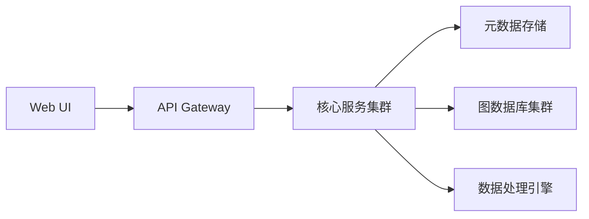

# Graph Mind Platform (GMP)


## 🌟 平台概述

Knowledge Atlas Platform (KAP) 是一款面向企业级应用的智能知识图谱管理系统，提供从数据建模、知识抽取到图谱分析的全生命周期解决方案。

## 🚀 核心功能

### 图谱管理
- 多图谱实例管理
- 图数据库配置管理（支持Neo4j/JanusGraph/Nebula/GES）
- 图谱版本控制

### 知识建模
- 可视化Schema设计器
- 实体/关系/属性动态定义
- 版本化Schema管理

### 数据集成
- 多源数据接入（数据库/文件/API）
- 批流一体处理（Spark+Flink）
- 智能ETL管道

### 知识服务
- 图查询引擎（Cypher/Gremlin）
- 路径分析与图计算
- 交互式可视化探索

## 🏗️ 系统架构



## 代码结构

```agsl
graph-system   
├── graph-mind-core          // 核心模块（抽象层）   
├── graph-mind-neo4j         // Neo4j 实现模块   
├── graph-mind-janus         // JanusGraph 实现模块   
├── graph-mind-nebula        // Nebula Graph 实现模块   
└── graph-mind-api           // 对外暴露的API模块   

```

## 🛠️ 快速部署
### 前置要求
- JD- K 17+
- MySQL 8.0+/PostgreSQL 14+
- 图数据库服务（至少一种）
- Node.js 16+（仅前端需要）

### 后端启动
```shell
# 1. 克隆仓库
git clone https://github.com/your-org/kap.git

# 2. 配置数据库
cp config/application-example.yml config/application.yml
vim config/application.yml  # 修改数据库配置

# 3. 启动服务
./mvnw spring-boot:run
```

### 前端启动
```shell
cd kap-ui
npm install
npm run dev
```

## 📊 核心模块

| 模块            | 功能说明         | 技术栈          |
|----------------|------------------|----------------|
| kap-core       | 核心模型与接口   | Java 17         |
| kap-storage    | 元数据管理       | Spring Data JPA |
| kap-db-*       | 图数据库适配器   | 各数据库驱动    |
| kap-processing | 数据处理引擎     | Spark/Flink     |
| kap-service    | 业务逻辑层       | Spring Boot     |
| kap-ui         | 管理控制台       | Vue3 + D3.js    |


## 📚 开发者指南
### 扩展新图数据库
1. 实现基础接口：
```java
@GraphDatabaseImpl(name = "yourdb")
public class YourDBAdapter implements GraphDatabase {
    // 实现必要方法
}
```
2. 注册SPI实现：
```text
# META-INF/services/com.kap.db.GraphDatabase
com.kap.db.yourdb.YourDBAdapter
```

3. 打包为独立模块：
```xml
<artifactId>kap-db-yourdb</artifactId>
```

## 🧩 典型应用场景
```shell
# 创建知识图谱
POST /api/v1/graphs
{
  "name": "finance-kg",
  "dbType": "neo4j",
  "description": "金融风控知识图谱"
}

# 批量导入数据
POST /api/v1/data/import
Content-Type: multipart/form-data

file=@customers.csv&mapping=@mapping.json
```


## 📜 许可证
Apache License 2.0

## 🤝 参与贡献
欢迎通过Issue和PR参与贡献，请确保：
1. 代码符合Google Java Style
2. 新功能包含完整单元测试
3. 文档同步更新

## 📮 联系我们
- 项目主页：https://github.com/chanpion/graph-mind
- 问题反馈：gmp-support@yourorg.com
- 技术交流群：扫码加入

