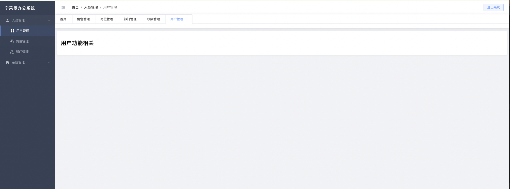

# 后台管理办公系统

[TOC]


# 一. 创建项目

## 1.1 项目概述

**后台办公系统** 是一个基于 **Vue 3** + **Vite** + **Element Plus** 的企业级管理平台，旨在提升公司员工的办公效率和管理便捷性。该系统采用 **动态路由、动态面包屑导航、多页签导航**，提供灵活的界面交互和高效的数据管理。

### **核心技术栈**

- **Vue 3**：采用 Composition API 进行组件化开发，提升代码复用性和可维护性。
- **Vite**：作为前端构建工具，提供极速冷启动、热更新和高效打包能力。
- **Element Plus**：基于 Vue 3 的 UI 组件库，提供美观、易用的界面组件。
- **动态路由**：基于 `vue-router`，支持权限控制，动态加载页面，提升系统扩展性。
- **动态面包屑**：根据当前路由自动生成导航路径，提升用户体验和操作便捷性。
- **多页签导航**：支持多个页面同时打开，并可自由切换，提高操作效率。




## 1.2 vite创建项目

```py
"""
ningcaichen@bogon 04-北京地铁内部开发平台 % npm create vue@latest

> npx
> create-vue


Vue.js - The Progressive JavaScript Framework

✔ 请输入项目名称： … vue_web_v1
✔ 是否使用 TypeScript 语法？ … 否 / 是
✔ 是否启用 JSX 支持？ … 否 / 是
✔ 是否引入 Vue Router 进行单页面应用开发？ … 否 / 是
✔ 是否引入 Pinia 用于状态管理？ … 否 / 是
✔ 是否引入 Vitest 用于单元测试？ … 否 / 是
✔ 是否要引入一款端到端（End to End）测试工具？ › 不需要
✔ 是否引入 ESLint 用于代码质量检测？ › 否

正在初始化项目 /Users/ningcaichen/Documents/02-python相关文档/04-北京地铁内部开发平台/vue_web_v1...

项目初始化完成，可执行以下命令：

  cd vue_web_v1
  npm install
  npm run dev

ningcaichen@bogon 04-北京地铁内部开发平台 % cd vue_web_v1 
ningcaichen@bogon vue_web_v1 %  npm install

"""


```


## 1.3 项目初始化

```py

"""
01 删除自带的组件，清空路由和样式

02 按照工具 vite-plugin-vue-setup-extend 


"""

#01 下载依赖`
npm i vite-plugin-vue-setup-extend -D

#02 导入包 vite.config.ts
import VueSetupExtend from 'vite-plugin-vue-setup-extend'			//导入

export default defineConfig({
  plugins: [
    vue(),
    vueDevTools(),
    VueSetupExtend(),																					//注册
  ],
  resolve: {
    alias: {
      '@': fileURLToPath(new URL('./src', import.meta.url))
    },
  },
})


#03 使用该模块

	
<script lang="ts" setup name="Person222">						//使用 name属性直接定义						
  // 直接定义数据即可，会自动帮你返回
    let name = '果果'

  
</script>


```

## 1.4 创建路由组件

```ts

// 主要是书写 /hom组件

import {createRouter, createWebHistory} from 'vue-router'


import Home from '@/views/Home.vue';

const router = createRouter({
    history: createWebHistory(import.meta.env.BASE_URL),
    routes: [

        // 重定向到home
        {
            path: '/',
            redirect: '/home'
        },

        {
            name: 'home',
            path: '/home',
            component: Home,
        },


    ],
})

export default router

```


## 1.5 引用element UI


```py

#01 安装
npm install element-plus --save

#02 全局引用
import './assets/main.css'

import { createApp } from 'vue'
import { createPinia } from 'pinia'

import ElementPlus from 'element-plus'
import 'element-plus/dist/index.css'

import App from './App.vue'
import router from './router'

const app = createApp(App)

app.use(createPinia())
app.use(router)
app.use(ElementPlus)

app.mount('#app')


```


# 二. 书写基本组件

```py
#01 基本目录如下
ningcaichen@bogon vue_web_v1 % tree src
src
├── App.vue												# 组件入口 
├── assets	
│   ├── base.css
│   ├── home.css									# home主页样式
│   ├── logo.svg
│   └── main.css
├── components										# 组件目录
│   └── layout
│       ├── Breadcrumb.vue				# 面包屑组件
│       ├── MainLayout.vue				# 空组件：用于加载路由内容
│       ├── Sidebar.vue						# 左侧菜单组件
│       └── Tags.vue							# 多页签导航组件
├── main.ts												# 主配置文件
├── router						
│   └── index.ts									# 路由配置文件
├── stores
│   ├── counter.ts								# pinia 默认存储store
│   └── tabs.ts										# 多页签导航状态存储文件				
├── utils
│   ├── commonData.ts							# 菜单数据
│   └── icons.ts									# 图标数据
└── views													# 路由文件
    ├── Home.vue
    ├── Index.vue
    ├── Login.vue
    ├── admin
    │   ├── permission
    │   │   └── Permission.vue
    │   └── role
    │       └── Role.vue
    └── system
        ├── dept
        │   └── Dept.vue
        ├── station
        │   └── Station.vue
        └── user
            └── User.vue


```


## 2.1 定义动态菜单数据 

`src/utils/commonData.ts`

```ts


// 定义接口规范
interface MenuItem {
    id: number
    authName: string
    icon: string
    path: string | null
    children: MenuItem[]
}
// 路由数据
export const menuData: { data: MenuItem[]; meta: any } = {
    data: [
        {
            id: 100,
            authName: "人员管理",
            icon: "Avatar",
            path: '/home/personnel',
            children: [
                { id: 100003, authName: "用户管理", path: "/home/personnel/user", icon: "Menu", children: [] },
                { id: 100001, authName: "岗位管理", path: "/home/personnel/station", icon: "Pointer", children: [] },
                { id: 100002, authName: "部门管理", path: "/home/personnel/dept", icon: "EditPen", children: [] }
            ]
        },
        {
            id: 102,
            authName: "系统管理",
            icon: "HomeFilled",
            path: '/home/admin',
            children: [
                { id: 102003, authName: "角色管理", path: "/home/admin/role", icon: "Food", children: [] },
                { id: 102001, authName: "权限管理", path: "/home/admin/permission", icon: "Opportunity", children: [] }
            ]
        }
    ],
    meta: {
        msg: "获取菜单成功",
        status: 200
    }
}


```

## 2.2 定义路由数据

`router/index.ts`

```ts
import { createRouter, createWebHistory } from 'vue-router'
import Home from '@/views/Home.vue'


// 人员管理模块
import User from '@/views/system/user/User.vue'
import Station from '@/views/system/station/Station.vue'
import Dept from '@/views/system/dept/Dept.vue'

// 系统管理模块
import Role from '@/views/admin/role/Role.vue'
import Permission from '@/views/admin/permission/Permission.vue'

// 布局组件
const MainLayout = () => import('@/components/layout/MainLayout.vue')


const router = createRouter({
    history: createWebHistory(import.meta.env.BASE_URL),
    routes: [
        {
            path: '/',
            redirect: '/home',
            meta: { hidden: true ,closable: true }
        },
        {
            path: '/home',
            name: 'Home',
            component: Home,
            meta: { title: '首页',closable: true  },
            // redirect: '/home/system', // 默认重定向到系统管理
            children: [
                // 人员管理子模块
                {
                    path: 'personnel',
                    name: 'Personnel',
                    component: MainLayout,
                    meta: { title: '人员管理',closable: true  },
                    children: [
                        { path: 'user', name: 'User', component: User, meta: { title: '用户管理',closable: true  } },
                        { path: 'station', name: 'Station', component: Station, meta: { title: '岗位管理',closable: true  } },
                        { path: 'dept', name: 'Dept', component: Dept, meta: { title: '部门管理' ,closable: true } }
                    ]
                },
                // 角色权限子模块
                {
                    path: 'admin',
                    name: 'Admin',
                    component: MainLayout,
                    meta: { title: '系统管理' ,closable: true },
                    children: [
                        { path: 'role', name: 'Role', component: Role, meta: { title: '角色管理',closable: true  } },
                        { path: 'permission', name: 'Permission', component: Permission, meta: { title: '权限管理',closable: true  } }
                    ]
                }
            ]
        }
    ]
})

export default router

```

- 注意这里引用一个空组件 后续会引用

```ts
<!-- src/layout/MainLayout.vue -->
<template>
  <div class="main-layout">
    <router-view />
  </div>
</template>

<script setup lang="ts">
// 空组件，仅用于路由嵌套
</script>

```


## 2.3 Home.vue 主页面布局

> 我们使用el-menu 组件创建布局

`src/views/Home.vue`

```ts
<template>
  <div class="system-container">
    <el-container class="main-wrapper">


      <!-- 左侧导航区域 Sidebar组件 -->
      <Sidebar
          :is-collapse="isCollapse"
          :menuData="menu_list.data"
          :active-menu-index="activeMenuIndex"
      />

      <!-- 右侧内容区 -->
      <el-container>
        <el-header class="operate-header">
          <div class="header-left">
            <el-button
                link
                class="collapse-btn"
                @click="toggleSidebar"
            >
              <el-icon :size="20">
                <component :is="collapseIcon"/>
              </el-icon>
            </el-button>


            <!--面包屑组件区域-->
            <div class="breadcrumb-container">
              <el-breadcrumb separator="/">
                <Breadcrumb/>
              </el-breadcrumb>
            </div>
          </div>
          <div class="toolbar">
            <el-button type="primary" plain>退出系统</el-button>
          </div>
        </el-header>

        <el-main>
          <div class="content-card">
            <div class="table-container">
              <RouterView/>
            </div>
          </div>
        </el-main>
      </el-container>
    </el-container>
  </div>
</template>

<script setup lang="ts">
import {ref, computed} from 'vue'
import {Fold, Expand} from '@element-plus/icons-vue'
import {menuData} from '@/utils/commonData'
import {useRoute} from "vue-router";

import Sidebar from "@/components/layout/Sidebar.vue";
import Breadcrumb from "@/components/layout/Breadcrumb.vue";

const route = useRoute();


// 侧边栏状态
const isCollapse = ref(false)
const toggleSidebar = () => {
  isCollapse.value = !isCollapse.value
}

// 菜单数据
const activeMenuIndex = ref('100')
const menu_list = menuData // 直接使用已响应式的数据

// 折叠图标计算属性
const collapseIcon = computed(() => isCollapse.value ? Expand : Fold)
</script>

<style scoped>
@import '@/assets/home.css';
</style>


```

## 2.4 添加css样式

`src/assets/home.css`

```css
/* 系统容器 */
.system-container {
    height: 100vh;
    --sidebar-bg: #304156;
    --header-bg: #ffffff;
    overflow: hidden;
}

/* 主布局 */
.main-wrapper {
    height: 100%;
}

/* 侧边栏区域 */
.nav-sidebar {
    background: var(--sidebar-bg);
    transition: width 0.3s ease;
}

/* 系统LOGO */
.system-logo {
    height: 60px;
    display: flex;
    align-items: center;
    padding: 0 20px;
    border-bottom: 1px solid rgba(255,255,255,0.1);
    transition: padding 0.3s;
}

.logo-text {
    color: #fff;
    font-size: 18px;
    font-weight: 600;
    letter-spacing: 1px;
    white-space: nowrap;
}

.logo-collapse {
    padding: 0 10px;
    justify-content: center;
}

/* 折叠按钮 */
.collapse-btn {
    color: #b0bac5;
    margin-right: 12px;
    transition: 0.3s;
}

.collapse-btn:hover {
    color: #fff;
    background-color: rgba(255,255,255,0.1);
}

/* 菜单深度样式 */
:deep(.sidebar-menu) {
    border-right: none !important;
}

:deep(.el-menu-item),
:deep(.el-sub-menu__title) {
    height: 46px;
    line-height: 46px;
    transition: all 0.3s;
}

:deep(.el-menu-item:hover),
:deep(.el-sub-menu__title:hover) {
    background-color: rgba(255,255,255,0.08) !important;
}

:deep(.el-menu-item.is-active) {
    background: rgba(64, 158, 255, 0.1) !important;
    border-left: 3px solid #409EFF;
}

.menu-icon {
    margin-right: 8px;
    font-size: 18px;
}

/* 折叠状态菜单 */
:deep(.el-menu--collapse) {
    border-right: none;
}

:deep(.el-menu--collapse .el-sub-menu > .el-menu) {
    display: none;
}

:deep(.el-menu--collapse .el-sub-menu__title span),
:deep(.el-menu--collapse .el-menu-item span) {
    display: none;
}

/* 头部区域 */
.operate-header {
    height: 56px;
    display: flex;
    justify-content: space-between;
    align-items: center;
    background: var(--header-bg);
    border-bottom: 1px solid #e4e7ed;
    padding: 0 24px;
}

.header-left {
    display: flex;
    align-items: center;
    gap: 12px;
}

.el-breadcrumb {
    font-size: 15px;
}

/* 内容区域 */
.content-card {
    background: #fff;
    border-radius: 4px;
    box-shadow: 0 2px 8px rgba(0,0,0,0.05);
    padding: 16px;
}

.table-container {
    margin-top: 12px;
}

```


## 2.5 左侧导航菜单组件

`src/components/layout/Breadcrumb.vue`

```ts
<template>
  <el-aside
      :width="isCollapse ? '64px' : '240px'"
      class="nav-sidebar"
  >
    <div class="system-logo" :class="{ 'logo-collapse': isCollapse }">
      <span v-if="!isCollapse" class="logo-text">易创盈办公系统</span>
      <span v-else class="logo-text">易</span>
    </div>

    <el-menu
        :default-active="activeMenuIndex"
        class="sidebar-menu"
        background-color="#304156"
        text-color="#b0bac5"
        active-text-color="#fff"
        :collapse="isCollapse"
        :collapse-transition="false"
        :router="true"
    >

      <!--      一级菜单-->
      <el-sub-menu
          v-for="item in menuData"
          :key="item.id"
          :index="String(item.id)"
      >
        <template #title>
          <el-icon class="menu-icon">
            <component :is="getIcon(item.icon)"/>
          </el-icon>
          <span>{{ item.authName }}</span>
        </template>


        <el-menu-item
            v-for="child in item.children"
            :key="child.id"
            :index="String(child.path)"
        >
          <el-icon>
            <component :is="getIcon(child.icon)"/>
          </el-icon>
          <span>{{ child.authName }}</span>
        </el-menu-item>
      </el-sub-menu>
    </el-menu>
  </el-aside>
</template>

<script setup lang="ts">

defineProps<{
  isCollapse: boolean
  menuData: any[]
  activeMenuIndex: string
}>()


import {getIcon} from '@/utils/icons'
</script>


<style scoped>
@import '@/assets/home.css';
</style>

```

## 2.5 动态图标组件 icons

`src/utils/icons.ts`

```ts

import {
    User, Avatar, Pointer, Menu,
    EditPen, Tools, HomeFilled, Food,
    Opportunity, Fold, Expand
} from '@element-plus/icons-vue'

// 类型定义
export type IconKey = keyof typeof iconComponents

// 图标映射对象（使用 as const 锁定类型）
export const iconComponents = {
    User,
    Avatar,
    Pointer,
    Menu,
    EditPen,
    Tools,
    HomeFilled,
    Food,
    Opportunity,
    Fold,
    Expand
} as const

// 获取图标函数（带安全类型）
export const getIcon = (iconName: string) => {
    const key = iconName as IconKey
    return iconComponents[key] || User  // 默认返回User图标
}

```

## 2.6 动态面包屑组件

`src/components/layout/Breadcrumb.vue`

```ts
<!-- src/components/common/Breadcrumb.vue -->
<template>
  <!-- 动态生成面包屑项 -->
  <el-breadcrumb separator="/">

    <!--  面包屑组件-->
    <!-- :to="item.path"    绑定跳转路径，如截图中可点击的导航 -->
    <el-breadcrumb-item
        v-for="(item, index) in breadcrumbItems"
        :key="index"
        :to="item.path"
    >
      <!-- 显示标题，如图中的"人员管理" -->
      {{ item.title }}

    </el-breadcrumb-item>


  </el-breadcrumb>
</template>

<script setup lang="ts">
import {computed} from 'vue'
import {useRoute} from 'vue-router'
import {menuData} from '@/utils/commonData' // 导入菜单数据（如截图左侧导航数据）

const route = useRoute() // 获取当前路由信息

// 核心计算属性：生成面包屑导航数据
const breadcrumbItems = computed(() => {
  const matched = route.matched
      .filter(item => !item.meta?.hidden)
      .map(item => {
        const titleSource = item.meta?.title ? '路由' : '菜单'
        const finalTitle = item.meta?.title || findMenuTitle(item.path)

        // 调试信息（与截图中的控制台日志格式匹配）
        console.log(
            `[面包屑来源] 路径: ${item.path.padEnd(25)} | 来源: ${titleSource.padEnd(4)} | 标题: ${finalTitle}`
        )

        return {
          path: item.path,
          title: finalTitle
        }
      })

  return matched.length ? matched : [{ path: '/home', title: '首页' }]
})

// 调试输出（对应截图底部控制台的日志输出）
console.log('当前面包屑数据:', breadcrumbItems.value)

// 从菜单数据查找标题,如果路由未设置 则从菜单里查找
const findMenuTitle = (path: string) => {
  // 扁平化菜单数据结构（包含多级菜单）
  const flatMenu = menuData.data.flatMap(item => [
    item,
    ...(item.children || []) // 展开子菜单（如"用户管理"展开到同级）
  ])

  // 查找匹配路径的菜单项
  return flatMenu.find(menu => menu.path === path)?.authName || path // 默认显示路径
}


</script>


```

- 图示


## 2.7 多页签导航

### (1) Pinia 定义数据和方法

`stores/tabs.tx`

```ts


import { defineStore } from 'pinia'

// 定义标签的数据结构
export interface Tab {
    title: string // 标签页名称
    path: string  // 标签页路由路径
    closable?: boolean // 是否可关闭（首页不能关闭）
}

// 定义 Pinia Store
export const useTabsStore = defineStore('tabs', {
    // state：存储数据
    state: () => ({
        // 初始化 tabs，默认包含首页，且首页不可关闭
        tabs: [{ title: '首页', path: '/home', closable: false }] as Tab[],

        // 当前激活的标签路径，默认激活首页
        activeTab: '/home'
    }),

    // actions：定义修改 state 的方法
    actions: {
        // 添加标签
        addTab(tab: Tab) {
            // 先检查这个标签是否已存在
            const exists = this.tabs.find(t => t.path === tab.path)
            if (!exists) {
                // 设置是否可关闭，首页不能被关闭
                tab.closable = tab.path === '/home' ? false : true
                this.tabs.push(tab) // 添加到 tabs 列表
            }
            // 设置当前激活的标签
            this.activeTab = tab.path
        },

        // 删除标签
        removeTab(path: string) {
            if (path === '/home') return // 首页不能被删除

            const index = this.tabs.findIndex(t => t.path === path)
            if (index > -1) {
                this.tabs.splice(index, 1) // 从 tabs 中移除

                // 如果删除的是当前激活的标签，调整 activeTab
                if (this.activeTab === path) {
                    // 如果被删除的标签后面还有标签，则激活下一个标签
                    if (index < this.tabs.length) {
                        this.activeTab = this.tabs[index].path
                    }
                    // 否则激活前一个标签
                    else if (index - 1 >= 0) {
                        this.activeTab = this.tabs[index - 1].path
                    }
                    // 如果删除后 tabs 为空，则回到首页
                    else {
                        this.activeTab = '/home'
                    }
                }
            }
        },

        // 设置当前激活的标签
        setActiveTab(path: string) {
            this.activeTab = path
        }
    },

    // Pinia 持久化存储，保证刷新页面后状态不会丢失
    persist: {
        key: 'tabsStore', // 存储的 key
        storage: localStorage, // 存储方式（localStorage 或 sessionStorage）
        paths: ['tabs', 'activeTab'] // 需要持久化的字段
    } as any // 这里使用 `as any` 避免 TypeScript 类型错误
})


```

### (2) Tags 组件

`src/components/layout/Tags.vue`

```ts

<template>
  <!-- Element Plus 的标签页组件 -->
  <!--
   绑定当前激活的标签页
   监听关闭标签页的事件
   允许手动关闭标签
   -->

  <el-tabs
      v-model="activeTab"
  type="card"
  @tab-remove="handleTabRemove"
  closable
  >
  <!--
    遍历所有标签页
    设定唯一的 key，提升渲染性能
    设定标签页的唯一标识符
    显示的标签名称
    控制是否可关闭（首页不可关闭）

  -->
  <el-tab-pane
      v-for="tab in tabs"
      :key="tab.path"
  :name="tab.path"
  :label="tab.title"
  :closable="tab.closable"
  >
  </el-tab-pane>
  </el-tabs>
</template>

<script setup lang="ts">
import { computed } from 'vue'
import { useRouter } from 'vue-router'
import { useTabsStore } from '@/stores/tabs'

const router = useRouter()  // 获取 Vue Router 实例
const tabsStore = useTabsStore()  // 获取标签页的状态管理

// 计算属性：获取当前所有的标签页数据
const tabs = computed(() => tabsStore.tabs)

// 计算属性：当前激活的标签页，支持双向绑定
const activeTab = computed({
  get: () => tabsStore.activeTab,  // 获取当前激活的标签页路径
  set: (val: string) => {
    tabsStore.setActiveTab(val)  // 更新 Pinia 中的状态
    router.push(val)  // 切换路由
  }
})

// 处理标签页的关闭事件
const handleTabRemove = (targetName: string) => {
  tabsStore.removeTab(targetName)  // 调用 store 方法删除标签
  router.push(tabsStore.activeTab)  // 切换到删除后的激活标签
}
</script>

<style scoped>
/* 整体 Tabs 容器样式 */
.el-tabs {
  background-color: #fff;               /* 背景颜色：白色 */
  border: 1px solid #ebeef5;            /* 浅灰色边框 */
  border-radius: 4px;                   /* 圆角边框 */
  margin: 1px 0;                        /* 上下外边距 */
  box-shadow: 0 2px 12px 0 rgba(0, 0, 0, 0.1); /* 添加柔和阴影 */
}

/* 标签页头部样式 */
.el-tabs__header {
  background-color: #fff;               /* 头部背景保持白色 */
  border-bottom: 1px solid #ebeef5;      /* 添加底部边框 */
  padding: 0 10px;                      /* 左右内边距 */
}

/* 单个标签页内容区域样式 */
.el-tab-pane {
  font-size: 14px;                      /* 统一字体大小 */
  padding: 2px;                         /* 内边距调整 */
}
</style>


```

### (3) 添加监听器

`home.vue` 文件中添加监听器

```ts
<template>
  <div class="system-container">
    <el-container class="main-wrapper">
      <!-- 左侧导航区域 Sidebar组件 -->
      <Sidebar
          :is-collapse="isCollapse"
          :menuData="menu_list.data"
          :active-menu-index="activeMenuIndex"
      />

      <!-- 右侧内容区 -->
      <el-container>
        <el-header class="operate-header">
          <div class="header-left">
            <el-button link class="collapse-btn" @click="toggleSidebar">
              <el-icon :size="20">
                <component :is="collapseIcon"/>
              </el-icon>
            </el-button>
            <!-- 面包屑组件区域 -->
            <div class="breadcrumb-container">
              <el-breadcrumb separator="/">
                <Breadcrumb/>
              </el-breadcrumb>
            </div>
          </div>
          <div class="toolbar">
            <el-button type="primary" plain>退出系统</el-button>
          </div>
        </el-header>

        <!-- 多页签导航组件 -->
        <Tags />

        <!-- 主要内容区域 -->
        <el-main>
          <div class="content-card">
            <div class="table-container">
              <RouterView/>
            </div>
          </div>
        </el-main>
      </el-container>
    </el-container>
  </div>
</template>

<script setup lang="ts">
import { ref, computed, watch } from 'vue'
import { Fold, Expand } from '@element-plus/icons-vue'
import { menuData } from '@/utils/commonData'
import { useRoute } from 'vue-router'

import Sidebar from '@/components/layout/Sidebar.vue'
import Breadcrumb from '@/components/layout/Breadcrumb.vue'
import Tags from '@/components/layout/Tags.vue'

// 引入 Pinia 页签 store
import { useTabsStore } from '@/stores/tabs'

const route = useRoute()
const tabsStore = useTabsStore()

// 监听路由变化，自动添加页签（首页处理特殊）
watch(
    () => route.path,
    (newPath) => {
      let title: string
      if (newPath === '/home') {
        title = '首页'
      } else {
        title = typeof route.meta.title === 'string' ? route.meta.title : '无标题'
      }
      tabsStore.addTab({ title, path: newPath })
    },
    { immediate: true }
)

// 侧边栏状态
const isCollapse = ref(false)
const toggleSidebar = () => {
  isCollapse.value = !isCollapse.value
}

// 菜单数据
const activeMenuIndex = ref('100')
const menu_list = menuData

// 折叠图标计算属性
const collapseIcon = computed(() => isCollapse.value ? Expand : Fold)
</script>

<style scoped>
@import '@/assets/home.css';
</style>


```


### (4) 修改样式

```css

 /* home.css 文件内添加 */

.el-main {
    --el-main-padding: 10px;      /* 边距 */
    box-sizing: border-box;
    display: block;
    flex: 1;
    flex-basis: auto;
    overflow: auto;
    padding: var(--el-main-padding);
}

```


## 2.8 持久化存储

```py

#01 下载 pinia-plugin-persistedstate
npm install pinia-plugin-persistedstate

#02 main.ts 导入
import './assets/main.css'
import { createApp } from 'vue'
import { createPinia } from 'pinia'
import piniaPluginPersistedstate from 'pinia-plugin-persistedstate'
import ElementPlus from 'element-plus'
import 'element-plus/dist/index.css'
import App from './App.vue'
import router from './router'

const pinia = createPinia()
pinia.use(piniaPluginPersistedstate)

const app = createApp(App)
app.use(pinia)
app.use(router)
app.use(ElementPlus)
app.mount('#app')

#03 pinia增加配置
export const useTabsStore = defineStore('tabs', {

    // Pinia 持久化存储，保证刷新页面后状态不会丢失
    persist: {
        key: 'tabsStore', // 存储的 key
        storage: localStorage, // 存储方式（localStorage 或 sessionStorage）
        paths: ['tabs', 'activeTab'] // 需要持久化的字段
    } as any // 这里使用 `as any` 避免 TypeScript 类型错误
  
  
})


```


```ts
<template>
  <div class="system-container">
    <el-container class="main-wrapper">
      <!-- 左侧导航 -->
      <el-aside
          :width="isCollapse ? '64px' : '240px'"
          class="nav-sidebar"
      >
        <div
            class="system-logo"
            :class="{ 'logo-collapse': isCollapse }"
        >
          <span class="logo-text" v-show="!isCollapse">易创盈办公系统</span>
          <span class="logo-text" v-show="isCollapse">易</span>
        </div>

        <el-menu
            :default-active="activeMenuIndex"
            class="sidebar-menu"
            background-color="#304156"
            text-color="#b0bac5"
            active-text-color="#fff"
            :collapse="isCollapse"
            :collapse-transition="false"
            :router="true"
        >
          <el-sub-menu
              :index="String(men_obj.id)"
              v-for="men_obj in menu_list.data"
              :key="men_obj.id"
          >
            <template #title>
              <el-icon class="menu-icon">
                <component :is="getIcon(men_obj.icon)" />
              </el-icon>
              <span>{{ men_obj.authName }}</span>
            </template>


            <template>
              <div class="system-container">
                <el-container class="main-wrapper">
                  <!-- 左侧导航 -->
                  <el-aside
                      :width="isCollapse ? '64px' : '240px'"
                      class="nav-sidebar"
                  >
                    <div
                        class="system-logo"
                        :class="{ 'logo-collapse': isCollapse }"
                    >
                      <span class="logo-text" v-show="!isCollapse">易创盈办公系统</span>
                      <span class="logo-text" v-show="isCollapse">易</span>
                    </div>

                    <el-menu
                        :default-active="activeMenuIndex"
                        class="sidebar-menu"
                        background-color="#304156"
                        text-color="#b0bac5"
                        active-text-color="#fff"
                        :collapse="isCollapse"
                        :collapse-transition="false"
                    >
<!--                      一级菜单开始-->

                      <el-sub-menu
                          :index="String(men_obj.id)"
                          v-for="men_obj in menu_list.data"
                          :key="men_obj.id"
                      >
                        <template #title>
                          <el-icon class="menu-icon">
                            <component :is="getIcon(men_obj.icon)" />
                          </el-icon>
                          <span>{{ men_obj.authName }}</span>
                        </template>

<!--                        二级菜单开始-->

                        <el-menu-item
                            :index="String(men.path)"
                            v-for="men in men_obj.children"
                            :key="men.id"
                        >
                          <el-icon>
                            <component :is="getIcon(men.icon)" />
                          </el-icon>
                          <span>{{ men.authName }}</span>
                        </el-menu-item>

<!--                        二级菜单结束-->

                      </el-sub-menu>

                      <!--                      一级菜单结束-->

                    </el-menu>
                  </el-aside>

                  <!-- 右侧内容区 -->
                  <el-container>
                    <el-header class="operate-header">
                      <div class="header-left">
                        <el-button
                            link
                            @click="toggleSidebar"
                            class="collapse-btn"
                        >
                          <el-icon :size="20">
                            <component :is="isCollapse ? Expand : Fold" />
                          </el-icon>
                        </el-button>
                        <div class="breadcrumb-container">
                          <el-breadcrumb separator="/">
                            <el-breadcrumb-item>首页</el-breadcrumb-item>
                            <el-breadcrumb-item>系统管理</el-breadcrumb-item>
                            <el-breadcrumb-item>用户管理</el-breadcrumb-item>
                          </el-breadcrumb>
                        </div>
                      </div>
                      <div class="toolbar">
                        <el-button type="primary" plain>退出系统</el-button>
                      </div>
                    </el-header>

                    <el-main>
                      <div class="content-card">
                        <div class="table-container">
                          主内容区


                        </div>
                      </div>
                    </el-main>
                  </el-container>
                </el-container>
              </div>
            </template>

            <el-menu-item
                :index="String(men.path)"
                v-for="men in men_obj.children"
                :key="men.id"
            >
              <el-icon>
                <component :is="getIcon(men.icon)" />
              </el-icon>
              <span>{{ men.authName }}</span>
            </el-menu-item>
          </el-sub-menu>
        </el-menu>
      </el-aside>

      <!-- 右侧内容区 -->
      <el-container>
        <el-header class="operate-header">
          <div class="header-left">
            <el-button
                link
                @click="toggleSidebar"
                class="collapse-btn"
            >
              <el-icon :size="20">
                <component :is="isCollapse ? Expand : Fold" />
              </el-icon>
            </el-button>
            <div class="breadcrumb-container">
              <el-breadcrumb separator="/">
                <el-breadcrumb-item>首页</el-breadcrumb-item>
                <el-breadcrumb-item>系统管理</el-breadcrumb-item>
                <el-breadcrumb-item>用户管理</el-breadcrumb-item>
              </el-breadcrumb>
            </div>
          </div>
          <div class="toolbar">
            <el-button type="primary" plain>退出系统</el-button>
          </div>
        </el-header>

        <el-main>
          <div class="content-card">
            <div class="table-container">
              主内容区
              <RouterView></RouterView>
            </div>
          </div>
        </el-main>
      </el-container>
    </el-container>
  </div>
</template>

<script setup lang="ts">
import { ref, reactive } from 'vue'
import {
  User, Avatar, Pointer, Menu,
  EditPen, Tools, HomeFilled, Food,
  Opportunity, Fold, Expand
} from '@element-plus/icons-vue'

// 侧边栏折叠状态
const isCollapse = ref(false)
const toggleSidebar = () => {
  isCollapse.value = !isCollapse.value
}

// 图标相关逻辑
const iconComponents = {
  User,
  Avatar,
  Pointer,
  Menu,
  EditPen,
  Tools,
  HomeFilled,
  Food,
  Opportunity
}

type IconKey = keyof typeof iconComponents

const getIcon = (iconName: string) => {
  const key = iconName as IconKey
  return iconComponents[key] || User
}

// 菜单数据
const activeMenuIndex = ref('100')
const menu_list = reactive({
  data: [
    {
      id: 100,
      authName: "用户管理",
      icon: "Avatar",
      path: null,
      children: [
        { id: 100003, authName: "用户查询", path: "/user", icon: "Menu", children: [] },
        { id: 100001, authName: "岗位管理", path: "/station", icon: "Pointer", children: [] },
        { id: 100002, authName: "部门管理", path: "/dept", icon: "EditPen", children: [] }
      ]
    },
    {
      id: 102,
      authName: "系统管理",
      icon: "HomeFilled",
      path: null,
      children: [
        { id: 102003, authName: "角色管理", path: "/role", icon: "Food", children: [] },
        { id: 102001, authName: "权限管理", path: "/permission", icon: "Opportunity", children: [] }
      ]
    }
  ],
  meta: {
    msg: "获取菜单成功",
    status: 200
  }
})

</script>

<style scoped>
/* 从home.css导入核心布局样式 */
@import '@/assets/home.css';


</style>

```
